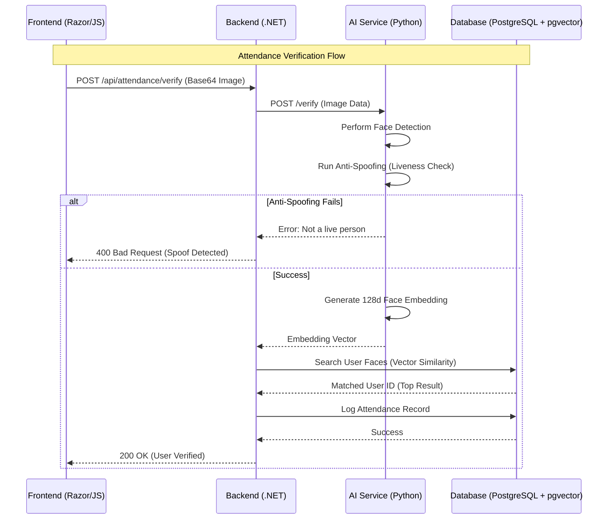

# System Architecture

This document provides a detailed look at the technical architecture of the Create Smart Attendance System.

## High-Level Design

The system is designed using a **Distributed Micro-monolith** pattern. This allows the AI-intensive tasks to be handled by a specialized Python service while the business logic and user management are managed by a robust .NET backend.

### Data & Execution Flow

The core of the system is the **Face Recognition Workflow**. Below is a sequence diagram illustrating how a user is verified for attendance.

## Core Components

### 1. Presentation Layer (frontend-web)

- **Technology**: ASP.NET Razor Pages.
- **Role**: Serves the UI and handles real-time camera streaming via JavaScript (`navigator.mediaDevices.getUserMedia`).
- **Communication**: Communicates with the Backend API via standard HTTP/REST.

### 2. Orchestration Layer (Create.API)

- **Technology**: ASP.NET Core 8 Web API.
- **Role**: Handles JWT authentication, request validation, and orchestrates calls between the AI Service and the database.
- **Security**: Implements Role-Based Access Control (RBAC).

### 3. Business Logic (Create.Application)

- **Technology**: Plain C# (POCOs, Interfaces).
- **Role**: Contains the "heart" of the system—use cases like "Register User", "Mark Attendance", and "Calculate Stats".

### 4. AI Engine (ai-service)

- **Technology**: Python 3.10, FastAPI, DeepFace, OpenCV.
- **Role**: Stateless microservice that performs heavy mathematical operations on images.
- **Anti-Spoofing**: Uses MiniFASNet or similar light-weight models to ensure liveness.

### 5. Data Layer (Create.Infrastructure)

- **Technology**: Entity Framework Core 8, Npgsql.
- **Database**: PostgreSQL with `pgvector` extension.
- **Vector Search**: Uses `<=>` (Cosine distance) operator for fast similarity matching.

## Security Model

1. **Authentication**: All Backend API endpoints (except login/register) require a valid JWT.
2. **AI Integrity**: The AI Service is typically hosted in a private network, accessible only by the Backend.
3. **Data Protection**: Facial embeddings are stored as high-dimensional vectors, which are one-way hashes of facial features (cannot be converted back to the original face image).
